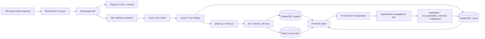

# KIRTA — AI Security Platform

**KIRTA** — AI-платформа для объяснимого анализа уязвимостей в Python-проектах.  
Проект объединяет SBOM, SCA-сканирование, статический анализ исходного кода, call map и AI-объяснение, чтобы помочь команде понять не только *какая CVE найдена*, но и *есть ли признаки её достижимости в конкретном коде*.

Проект доступен по адресу: **https://kirta-security.ru/**

KIRTA работает как AI-слой поверх результатов Syft/Grype и статического анализа кода: снижает шум, помогает приоритизировать исправления и переводит технический отчёт в понятное объяснение для security, development и product-команд.

> Текущий репозиторий — MVP для Python-проектов и SCA-сценария. В нём реализован полный backend-пайплайн загрузки ZIP → SBOM → SCA → call map → отчёт, on-demand AI explanation для отдельного finding, frontend-интерфейс и CLI-инструменты для генерации артефактов.

---

## Ссылки и быстрый доступ

| Раздел | Где находится |
|---|---|
| Лендинг | https://kirta-security.ru/ |
| Страница авторизации | https://kirta-security.ru/login |
| Демо-логин | `parker` |
| Демо-пароль | `parker` |
| Список сканирований | `/scans` |
| Страница отчёта | `/:scanId`, например `/1` |
| Swagger UI | `/swagger/index.html` при запущенном backend |
| OpenAPI спецификация | `kirta-backend-api/openapi.yaml` |
| Лицензия | MIT License |

Демо-доступ позволяет посмотреть основной flow MVP: landing page, список сканирований, загрузку ZIP-архива, SCA-отчёт, call map, просмотр исходного кода и AI explanation для finding.

---

## Проблема

Классические security-сканеры хорошо находят известные уязвимости, но часто оставляют команду с несколькими нерешёнными вопросами:

1. Уязвимая библиотека действительно используется в проекте или просто присутствует в зависимостях?
2. Есть ли вызовы этой библиотеки в коде, связанные с потенциально опасным сценарием?
3. Что нужно исправлять первым: CVE с высокой формальной severity или CVE, которая реально достижима в бизнес-логике?
4. Как объяснить риск разработчикам и продуктовой команде без ручного разбора большого JSON-отчёта?

В результате очередь security-задач превращается в ручной разбор: часть findings оказывается нерелевантной, часть требует долгого анализа, а действительно опасные дефекты могут теряться среди шума.

---

## Наше решение

KIRTA добавляет к классическому SCA-результату контекст исходного кода и AI-интерпретацию.

Платформа:

- принимает ZIP-архив Python-проекта;
- строит SBOM через Syft;
- запускает SCA через Grype;
- преобразует большой SCA-отчёт в компактный формат findings;
- анализирует Python-код через AST/import/call tracing;
- строит call map по уязвимым библиотекам;
- сохраняет результаты скана, графы вызовов и исходные файлы, связанные с findings;
- по запросу генерирует AI-объяснение для конкретной уязвимости;
- показывает результат во frontend: список сканов, отчёт, findings, call map и исходный код с подсветкой строк.

Главная идея: **не просто показать CVE, а показать доказательство в коде и объяснить, почему finding важен или не подтверждён текущими статическими фактами**.

---

## Платформа KIRTA

KIRTA показывает весь путь от загрузки Python-проекта до объяснимого security-отчёта: список сканов, SCA findings, call map, исходный код и AI explanation для отдельной уязвимости.

> Скриншоты находятся в `docs/assets/`. Они демонстрируют публичный стенд, основной пользовательский flow и ключевые evidence-механики продукта.

### Лендинг


### Вход


### Загрузка зип-архива


### История сканирований


### Отчет о сканировании


### AI обьяснение о находке


### Карта вызовов


---

## Почему здесь нужен AI

Без AI KIRTA могла бы показать только технические факты: пакет, версию, CVE, severity и найденные вызовы библиотеки. Это полезно, но не отвечает на главный вопрос команды: *что означает этот набор фактов для реального риска продукта?*

AI в KIRTA используется не как “магическая оценка”, а как интерпретатор структурированного security-контекста:

- получает CVE, описание уязвимости, severity и ограниченный call map;
- анализирует, есть ли признаки практической достижимости;
- возвращает строго структурированный JSON по заданной схеме;
- формирует короткое объяснение на русском языке;
- помогает перевести технические артефакты в понятное решение: чинить сейчас, отложить или отправить на ручную проверку.

В backend реализован OpenRouter-compatible клиент с `response_format: json_schema`, `strict: true`, `temperature: 0`, retry-логикой и валидацией ответа модели. Текущая схема AI-ответа компактная:

```json
{
  "exploitable": true,
  "explanation": "Есть достижимый вызов уязвимой библиотеки в коде проекта."
}
```

Backend сохраняет результат обратно в SCA-отчёт scan-а и возвращает обновлённый finding.

---

## Как работает KIRTA



### Основной pipeline

| Шаг | Что происходит | Реализация в репозитории |
|---|---|---|
| 1 | Пользователь загружает ZIP-архив проекта | `POST /v1/scan` |
| 2 | Backend распаковывает архив, считает SHA-256 и SLOC | `internal/service/scan_service.go` |
| 3 | Syft строит SBOM в CycloneDX JSON | `runSyftSBOM()` |
| 4 | Grype строит SCA-отчёт по SBOM | `internal/service/sca/scanner.go` |
| 5 | Python-скрипт преобразует Grype JSON в список findings | `kirta-backend-api/sca.py`, `tracer.py` |
| 6 | Python analyzer строит call map по уязвимым библиотекам | `kirta-backend-api/graph.py`, `tracer.py` |
| 7 | Scan, findings и графы сохраняются в PostgreSQL | `internal/persistance/db/postgres_repository.go` |
| 8 | Исходные файлы из call map сохраняются в MinIO | `internal/storage/s3.go` |
| 9 | Frontend показывает историю сканов и отчёт | `kirta-ui/src` |
| 10 | По запросу пользователь запускает AI explanation для finding | `POST /v1/scans/{id}/findings/{finding_id}/explanation` |

---

## Архитектура репозитория

```text
.
├── kirta-backend-api/                 # Backend API на Go/Gin
│   ├── cmd/main.go                    # Точка входа backend-сервиса
│   ├── internal/api/                  # HTTP handlers, routes, middleware
│   ├── internal/app/                  # Инициализация приложения, миграции, DI
│   ├── internal/config/               # YAML-конфигурация
│   ├── internal/domain/               # Domain DTO: ScanInfo, ScaFinding, Graph
│   ├── internal/persistance/db/       # PostgreSQL repository
│   ├── internal/service/              # Scan pipeline, SCA, AI enrichment
│   ├── internal/storage/              # MinIO/S3-compatible storage
│   ├── migrations/                    # SQL migrations для схемы kirta
│   ├── docs/                          # Swagger docs generated by swaggo
│   ├── openapi.yaml                   # OpenAPI specification
│   ├── sca.py                         # Преобразование Grype JSON в findings
│   ├── graph.py                       # Построение call_map по библиотекам
│   └── tracer.py                      # AST/import/call tracing для Python
│
├── kirta-ui/                          # Frontend на React + TypeScript + Vite
│   ├── src/app/                       # Router, providers, app shell
│   ├── src/pages/                     # Landing, Login, Scans, ScanReport, NotFound
│   ├── src/features/                  # Auth, scans, SCA widgets, theme
│   ├── src/repositories/              # HTTP repositories для backend API
│   ├── src/components/                # UI и layout-компоненты
│   └── deploy/nginx/                  # Nginx template и HTTPS setup script
│
├── docs/assets/                       # Скриншоты продукта для README
│   ├── landing.png
│   ├── login.png
│   ├── upload.png
│   ├── scans.png
│   ├── report.png
│   ├── finding-ai.png
│   └── call-map.png
│
├── kirta.py                           # CLI pipeline: Syft → Grype → Tiny-SCA → package trace
├── sca-tinifier.py                    # Сжатие Grype SCA JSON в compact Tiny-SCA
├── tiny-sca-schema.json               # JSON schema для Tiny-SCA формата
├── tools/kirta_analyzer.py            # AST/call graph analyzer для CLI pipeline
├── tools/kirta_agent_input_builder.py # Сборка входного JSON для KIRTA Agent
├── LICENSE                            # MIT License
└── README.md                          # Описание проекта
```

---

## Backend overview

Backend реализован на Go с Gin и отвечает за orchestration всего scan-пайплайна.

### Ключевые возможности backend

- загрузка ZIP-архива Python-проекта;
- безопасная распаковка ZIP с защитой от Zip Slip;
- проверка наличия Python-кода в архиве;
- подсчёт SLOC и языков проекта через `go-enry`;
- генерация SBOM через Syft;
- запуск Grype по SBOM;
- вызов Python-скриптов для SCA normalization и call map;
- сохранение scan metadata, findings и graphs в PostgreSQL;
- сохранение source files из call map в MinIO/S3-compatible storage;
- выдача исходного файла по API для просмотра во frontend;
- on-demand AI enrichment для отдельного finding;
- Swagger/OpenAPI документация.

### Статусы exploitability в текущем MVP

В текущей backend-модели используется три статуса:

| Статус | Значение |
|---|---|
| `exploitable` | AI и call map нашли признаки достижимости finding-а |
| `not_exploitable` | В текущих статических фактах нет подтверждённых вызовов уязвимого пакета или AI вернул отрицательную оценку |
| `unknown` | Не удалось надёжно получить/проверить AI-объяснение, требуется ручная проверка |

---

## Frontend overview

Frontend реализован как SPA на React + TypeScript + Vite.

### Что есть во frontend

| Раздел | Возможность |
|---|---|
| Landing page | Продуктовое описание KIRTA, проблема, решение, demo KPI |
| Login page | Demo/mock auth для MVP. На публичном стенде используется демо-доступ `parker / parker` |
| Scans page | История сканирований, статусы, SLOC, SHA-256, даты |
| Upload dialog | Drag-and-drop загрузка `.zip`, ограничение размера до 200 МБ |
| Scan report page | Загрузка отчёта по `scanId` |
| SCA widgets | Severity badge, exploitability pill, fixed versions block |
| Call map panel | Отображение файлов и вызовов уязвимой библиотеки |
| Source code modal | Получение исходного файла из backend и подсветка строк с вызовами |
| Theme | Переключение темы через Zustand/localStorage |
| Routing | Защита `/:scanId` через проверку формата ID, чтобы route не перехватывал `/scans`, `/login`, `/assets` и служебные пути |

Frontend ходит в backend через repository layer. По умолчанию API base URL — `/api`, а Vite dev server проксирует `/api` на `http://localhost:8080`.

---

## Analysis / CLI tools

В корне репозитория есть отдельный CLI-пайплайн для генерации артефактов без запуска web-приложения.

### `kirta.py`

Запускает полный artifact generation pipeline:

1. Syft → `<repo>.cdx.json`
2. Grype → `<repo>-sca.json`
3. `sca-tinifier.py` → `<repo>-tiny-sca.json`
4. `tools/kirta_analyzer.py` → `<repo>-package-trace.json`

Пример:

```bash
python3 kirta.py ./path/to/python-project -o ./reports/python-project
```

### `sca-tinifier.py`

Преобразует большой Grype JSON в компактный Tiny-SCA формат: CVE, package, version, severity, CWE, описание и locations.

```bash
python3 sca-tinifier.py \
  --source ./reports/project/project-sca.json \
  --output ./reports/project/project-tiny-sca.json
```

### `tools/kirta_analyzer.py`

Строит AST summary, import resolution и call graph для Python-проекта. В режиме `--source` анализирует все пакеты из Tiny-SCA и генерирует package trace.

```bash
python3 tools/kirta_analyzer.py \
  --project ./path/to/python-project \
  --source ./reports/project/project-tiny-sca.json \
  --output ./reports/project/project-package-trace.json
```

### `tools/kirta_agent_input_builder.py`

Объединяет Tiny-SCA и package trace в единый structured JSON для AI Agent.

```bash
python3 tools/kirta_agent_input_builder.py \
  --repo-name project \
  --project ./path/to/python-project \
  --tiny-sca ./reports/project/project-tiny-sca.json \
  --package-trace ./reports/project/project-package-trace.json \
  --output ./reports/project/project-agent-input.json
```

---

## Технологический стек

| Слой | Технологии |
|---|---|
| Backend | Go, Gin, pgx, golang-migrate, swaggo/gin-swagger |
| Storage | PostgreSQL, JSONB, MinIO / S3-compatible storage |
| Security tooling | Syft, Grype |
| Static analysis | Python `ast`, import resolution, call tracing, package aliases |
| AI integration | OpenRouter-compatible Chat Completions API, strict JSON schema response |
| Frontend | React 18, TypeScript, Vite, React Router v6, TanStack Query, Zustand |
| UI | Tailwind CSS, shadcn-style primitives, Radix UI, lucide-react, react-syntax-highlighter |
| Deployment assets | Nginx config template, HTTPS setup script with certbot |
| License | MIT |

---

## Техно-продуктовый вклад KIRTA

KIRTA решает не только техническую, но и продуктовую проблему security-процессов.

| Критерий | Как KIRTA отвечает |
|---|---|
| Реальная польза бизнесу | помогает быстрее понять, какие уязвимости создают реальный риск для продукта |
| AI как ключевая часть продукта | AI превращает SBOM/SCA/call-map факты в объяснимое решение для команды |
| Техническая реализация | есть backend pipeline, storage, OpenAPI, SCA tooling, call-map analyzer, structured AI output и frontend |
| Измеримый результат | метрики считаются из артефактов: findings, severity, code usage, call count, AI coverage, unknown rate |
| Нестандартность применения ИИ | AI применяется не для генерации текста “поверх всего”, а для интерпретации структурированного security-контекста |
| Качество подачи | продукт показывает проблему, решение, технологию, ограничения, KPI и demo flow |

---

## License

Проект распространяется под лицензией **MIT**. Подробности — в файле [`LICENSE`](./LICENSE).
