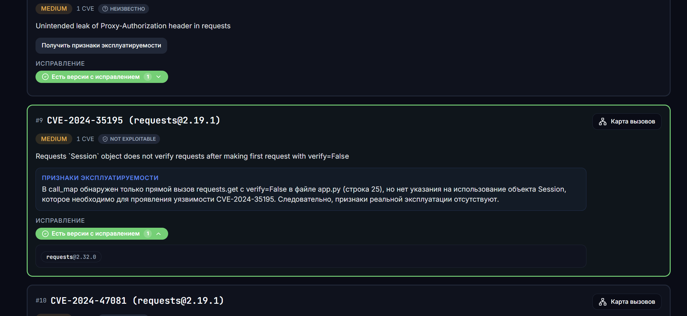

# KIRTA — AI Security Platform

<p align="left">
   <a href="https://kirta-security.ru/"></a> <a href="./LICENSE"></a>
</p>

<p align="left">
  
</p>

**Основной стек технологий:** Go, Gin, Python, React, TypeScript, PostgreSQL, MinIO/S3, Docker, Nginx  
**Security-инструменты:** Syft, Grype, static code analysis (построение call map)
**AI:** клиент OpenRouter для AI-анализа

---

# **KIRTA** — AI-платформа для анализа уязвимостей исходном коде помогающая повысить безопасность продукта.

Проект объединяет **SCA-сканирование**, **статический анализ исходного кода**, **карту вызовов** и **AI-объяснение**, чтобы помочь команде понять не только *какая CVE найдена*, но и *есть ли признаки её достижимости в конкретном коде*.

KIRTA работает как AI-слой поверх результатов классических сканеров исходного кода: снижает шум, помогает приоритизировать исправления и переводит технический security-отчёт в понятное объяснение для security, development и product-команд.

> Карта вызовов (или call map) - это технология которая позволяет просмотреть все вызовы библиотеки в исходном коде

## Поддерживаемая функциональность в рамках MVP-реализации
1. Поддержка анализа только Python-кода
2. Построение карты вызовов (call_map) только для Python-кода
3. Поддержка одного SBOM-генератора: `Syft`
4. Поддержка одного SCA-сканера: `Grype`
5. Подсчет строк проекта (SLOC) и языковой анализ проекта
6. Поддержка только SCA-сканирования
7. Поддержка только синхронного сканирования
8. Из-за большого количества требуемых вызовов LLM решено было в рамках MVP ограничить AI-анализа только бесплатными LLM-моделями сервиса `OpenRouter`
Для выбора модели мы основывались на навыке программировании LLM. Поэтому используем следующую модель: 
* `openai/gpt-oss-120b:free` (#28 место в рейтинге Programming по версии OpenRouter)
---

## Live demo

Проект доступен по адресу: **https://kirta-security.ru/**

Демо-вход в приложение: **https://kirta-security.ru/login**

```text
Логин: parker
Пароль: parker
```

Демо-доступ позволяет посмотреть основной flow MVP:

- Landing-страницу;
- историю сканирований;
- загрузку ZIP-архива;
- SCA-отчёт;
- карту вызовов (call map);
- просмотр вызовов библиотеки в исходном коде;
- AI-объяснение эксплуатируемости для отдельного дефекта.

---

## Быстрый доступ

| Раздел | Где находится |
|---|---|
| Вебсайт | `https://kirta-security.ru/` |
| Авторизация | `https://kirta-security.ru/login` |
| Демо-логин | `parker` |
| Демо-пароль | `parker` |
| Список сканирований | `https://kirta-security.ru/scans` |
| Страница отчёта | `/:scanId`, например `https://kirta-security.ru/1` |
| Swagger UI | `/swagger/index.html` при запущенном backend |
| OpenAPI specification | `kirta-backend-api/openapi.yaml` |
| License | MIT License |

---

## Проблема

Классические security-сканеры хорошо находят известные уязвимости, но часто оставляют команду с несколькими нерешёнными вопросами:

1. Уязвимая библиотека действительно используется в проекте или просто присутствует в зависимостях?
2. Есть ли вызовы этой библиотеки в коде, связанные с потенциально опасным сценарием?
3. Что исправлять первым: CVE с высокой формальной severity или CVE, которая реально достижима в бизнес-логике?
4. Как объяснить риск разработчикам и продуктовой команде без ручного разбора большого JSON-отчёта?
> **False-positive** (ложноположительный) дефект в статическом анализе безопасности — это ошибочное предупреждение инструмента, указывающее на уязвимость в коде, которой на самом деле нет.


Из-за большого количества `false-positive` дефектов у команд разработки и безопасности пропадает доверие к security-сканерам, в результате этого реально эксплуатируемые дефекты пропускаются, а специалисты тратят много времени на разбор большого количества false-positive. 

---

## Решениe
KIRTA добавляет к классическому сканированию контекст исходного кода и AI-интерпретацию.

Главная идея: **обычные SCA/SAST/DAST-инструменты показывают список дефектов, а KIRTA с помощью AI-анализа показывает признаки эксплуатируемости в прямо коде, и предоставляет объяснение почему дефект важен или не подтверждён текущими статическими фактами. Также с помощью карты вызовов библиотеки специалистам по разработке и безопасности не приходится вручную разбирать дефекты безопасности, а прямо в платформе увидеть значимость и достижимость того или иного дефекта безопасности в их проекте**.

## Страницы KIRTA AI Security Platform

### Лендинг


### Авторизация


### Загрузка зип-архива


### История сканирований


### Отчет о сканировании


### AI обьяснение о найденном дефекте


### AI обьяснение о найденном дефекте



### Карта вызовов


---

## Почему здесь нужен AI

Без AI KIRTA могла бы показать только технические факты:

- package;
- version;
- CVE;
- severity;
- fixed versions;
  

Это полезно, но не отвечает на главный вопрос команды: **что означает этот набор фактов для реального риска продукта?**

AI в KIRTA используется не как “магическая оценка”, а как интерпретатор структурированного security-контекста:

- получает CVE, описание уязвимости, severity и ограниченный call map;
- анализирует, есть ли признаки практической достижимости;
- возвращает строго структурированный ответ;
- формирует короткое объяснение на русском языке;
- помогает перевести технические артефакты в решение: чинить сейчас, отложить или отправить на ручную проверку.

В backend реализован OpenRouter AI клиент с:

- `response_format: json_schema`;
- `strict: true`;
- `temperature: 0`;
- валидацией ответа модели;
- ограничением размера call map, отправляемого в модель.

---

## Верхнеуровная архитектура KIRTA AI SECURITY PLATFORM


---

## Техно-продуктовый вклад

KIRTA решает не только техническую, но и продуктовую проблему security-процессов.

| Критерий | Как KIRTA отвечает |
|---|---|
| Реальная польза бизнесу | Помогает быстрее понять, какие уязвимости создают реальный риск для продукта |
| AI как ключевая часть продукта | AI превращает SBOM/SCA/call-map факты в объяснимое решение для команды |
| Техническая реализация | Есть backend pipeline, storage, OpenAPI, SCA tooling, call-map analyzer, AI enrichment и frontend |
| Измеримый результат | Метрики считаются из scan artifacts: findings, severity, code usage, AI coverage, unknown rate |
| Нестандартность применения ИИ | AI применяется не для генерации текста “поверх всего”, а для интерпретации структурированного security-контекста |
| Качество подачи | Продукт показывает проблему, решение, технологию, ограничения, KPI и demo flow |

## API overview

| Method | Endpoint | Назначение |
|---|---|---|
| `POST` | `/v1/scan` | Загрузить ZIP-архив и запустить анализ |
| `GET` | `/v1/scans` | Получить список сканирований |
| `GET` | `/v1/scans/{id}` | Получить полный отчёт по скану |
| `GET` | `/v1/scans/{id}/graphs?package=<name>` | Получить call map для библиотеки |
| `GET` | `/v1/scans/{id}/files/{filepath}` | Получить исходный файл из storage |
| `POST` | `/v1/scans/{id}/findings/{finding_id}/explanation` | Сгенерировать AI explanation для finding |

---

## Статусы эксплуатируемости

| Статус | Значение |
|---|---|
| `exploitable` | Есть признаки эксплуатируемости  дефекта по текущим статическим фактам и AI-анализу |
| `not_exploitable` | В текущих статических фактах нет подтверждённых вызовов уязвимого пакета или AI вернул отрицательную оценку |
| `unknown` | Недостаточно данных для уверенного вывода, требуется ручная проверка |

Важно: KIRTA не утверждает, что статический анализ гарантирует эксплуатацию или полную безопасность. Платформа помогает быстрее оценить признаки достижимости и приоритет исправления.

---

## Архитектура репозитория

```text
.
├── kirta-backend-api/                  # Backend API на Go/Gin
│   ├── cmd/main.go                     # Точка входа backend-сервиса
│   ├── internal/api/                   # HTTP handlers, routes, middleware
│   ├── internal/app/                   # Инициализация приложения
│   ├── internal/config/                # YAML-конфигурация
│   ├── internal/domain/                # Domain DTO: ScanInfo, ScaFinding, Graph
│   ├── internal/persistance/db/        # PostgreSQL repository
│   ├── internal/service/               # Scan pipeline, SCA, AI enrichment
│   ├── internal/storage/               # MinIO/S3-compatible storage
│   ├── migrations/                     # SQL migrations
│   ├── docs/                           # Swagger docs generated by swaggo
│   ├── openapi.yaml                    # OpenAPI specification
│   ├── sca.py                          # Преобразование Grype JSON в findings
│   ├── graph.py                        # Построение call map по библиотекам
│   └── tracer.py                       # AST/import/call tracing для Python
│
├── kirta-ui/                           # Frontend на React + TypeScript + Vite
│   ├── src/app/                        # Router, providers, app shell
│   ├── src/pages/                      # Landing, Login, Scans, ScanReport, NotFound
│   ├── src/features/                   # Auth, scans, SCA widgets, theme
│   ├── src/repositories/               # Repository/API layer
│   ├── src/components/                 # UI и layout-компоненты
│   └── deploy/nginx/                   # Nginx template и HTTPS setup script
│
├── docs/assets/                        # Скриншоты для README
├── docs/assets/badges/                 # Иконки для README
│
├── tools/                              # CLI analysis helpers
├── kirta.py                            # CLI pipeline: Syft → Grype → Tiny-SCA → package trace
├── sca-tinifier.py                     # Сжатие Grype SCA JSON в compact Tiny-SCA
├── tiny-sca-schema.json                # JSON schema для Tiny-SCA формата
├── LICENSE                             # MIT License
└── README.md                           # Project overview
```

---

## Backend overview

Backend реализован на **Go + Gin** и отвечает за orchestration всего scan-пайплайна.

### Ключевые возможности backend

- загрузка ZIP-архива Python-проекта;
- безопасная распаковка ZIP с защитой от Zip Slip;
- проверка наличия Python-кода в архиве;
- подсчёт SLOC и языкового состава проекта;
- генерация SBOM через Syft;
- запуск Grype по SBOM;
- нормализация SCA-результата;
- построение call map по уязвимым библиотекам;
- сохранение scan metadata, findings и graphs в PostgreSQL;
- сохранение source files из call map в MinIO/S3-compatible storage;
- выдача исходного файла по API для просмотра во frontend;
- on-demand AI enrichment для отдельного finding;
- Swagger/OpenAPI документация.

### Backend stack

| Слой | Технологии |
|---|---|
| HTTP API | Go, Gin |
| Database | PostgreSQL, JSONB, pgx |
| Migrations | golang-migrate |
| Object storage | MinIO / S3-compatible storage |
| SCA tooling | Syft, Grype |
| Static analysis | Python `ast`, import resolution, call tracing |
| AI integration | OpenRouter-compatible Chat Completions API |
| API docs | OpenAPI, Swagger UI, swaggo |

---

## Frontend overview

Frontend реализован как SPA на **React + TypeScript + Vite**.

### Что есть во frontend

| Раздел | Возможность |
|---|---|
| Landing page | Продуктовое описание KIRTA, проблема, решение, demo flow |
| Login page | Demo/mock auth для MVP; на публичном стенде используется `parker / parker` |
| Scans page | История сканирований, статусы, SLOC, SHA-256, даты |
| Upload dialog | Drag-and-drop загрузка `.zip`, ограничение размера до 200 MB |
| Scan report page | Загрузка полного отчёта по `scanId` |
| SCA widgets | Severity badge, exploitability pill, fixed versions block |
| Search/filtering | Поиск по package/CVE/description и фильтрация по severity |
| Call map panel | Отображение файлов и вызовов уязвимой библиотеки |
| Source code modal | Получение исходного файла из backend и подсветка строк с evidence |
| Theme | Переключение темы через Zustand/localStorage |
| Routing | Проверка формата `/:scanId`, чтобы route не перехватывал `/scans`, `/login`, `/assets` и служебные пути |

Frontend ходит в backend через repository/API layer. По умолчанию API base URL — `/api`, а Vite dev server проксирует `/api` на backend.

### Frontend stack

| Слой | Технологии |
|---|---|
| Core | React 18, TypeScript, Vite |
| Routing | React Router v6 |
| Async data | TanStack Query |
| State | Zustand |
| UI | Tailwind CSS, shadcn-style primitives, Radix UI, lucide-react |
| Code viewer | react-syntax-highlighter |
| Quality | ESLint, Prettier |

## Быстрый старт: frontend

```bash
cd kirta-ui
npm install
npm run dev
```

Production build:

```bash
npm run build
npm run preview
```

Lint/format:

```bash
npm run lint
npm run format
```

---

## Быстрый старт: backend

Backend требует настроенные PostgreSQL, MinIO/S3-compatible storage, Syft и Grype.

### 1. Установить внешние инструменты

Нужны бинарники:

```text
syft
grype
```
Они должны быть доступны в `PATH` или указаны в конфигурации backend.

### 2. Подготовить конфигурацию

```bash
cd kirta-backend-api
cp config.example.yaml config.yaml
```

В `config.yaml` нужно заполнить:

- PostgreSQL connection;
- MinIO/S3 credentials;
- bucket name;
- paths to Syft/Grype;
- OpenRouter API key and model for AI explanation.

### 3. Запустить backend

```bash
go run ./cmd
```

По умолчанию backend стартует на:

```text
http://localhost:8080
```

Swagger UI:

```text
http://localhost:8080/swagger/index.html
```

---

## Конфигурация AI

Пример AI-related настроек в `config.yaml`:

```yaml
app:
  openrouter_api_key: "YOUR_OPENROUTER_API_KEY"
  openrouter_model: "openai/gpt-4.1-mini"
  openrouter_base_url: "https://openrouter.ai/api/v1"
  openrouter_timeout: 20s
  openrouter_callmap_max_files: 20
  openrouter_callmap_max_calls: 200
```

AI-эксплуатируемость рассчитывается on-demand для отдельного дефекта по запросу через API endpoint:

```http
POST /v1/scans/{id}/findings/{finding_id}/explanation
```

## Roadmap

### До ближайшего развития MVP

- поддержка большого количества других языков программирования, помимо Python;
- расширить схему AI-вердикта: confidence, priority, reason codes, recommendation;
- добавить массовую AI-приоритизацию дефектов;
- улучшить цепочку эксплуатируемости в UI;


### Дальше

- поддержка SAST findings;
- поддержка DAST findings;
- secrets/IaC/container security signals;
- интеграции с SourceCraft, GitHub/GitLab;
- team workspace;
- role-based access;
- CI/CD mode для автоматического анализа pull requests.

---

## License

Проект распространяется под лицензией **MIT**: [`LICENSE`](./LICENSE)
