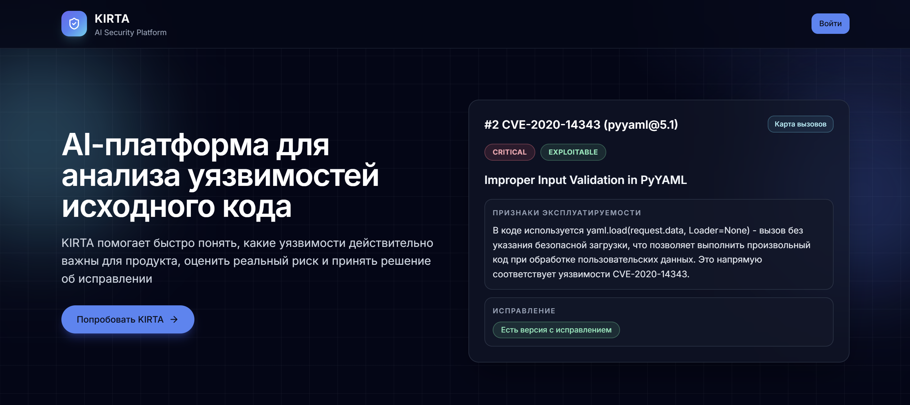
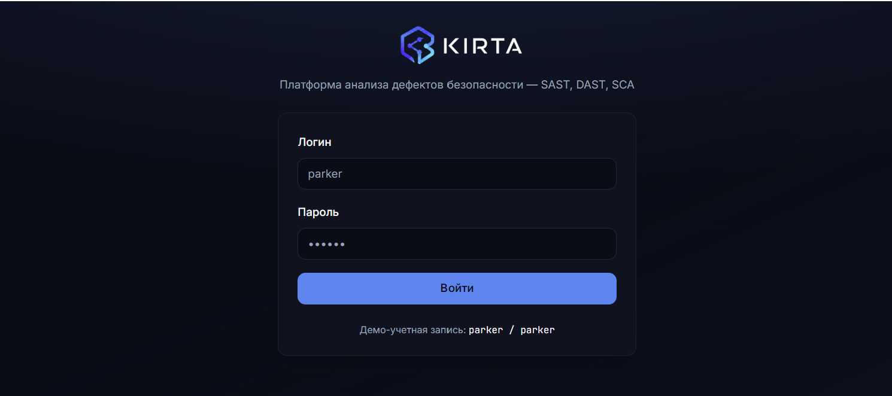
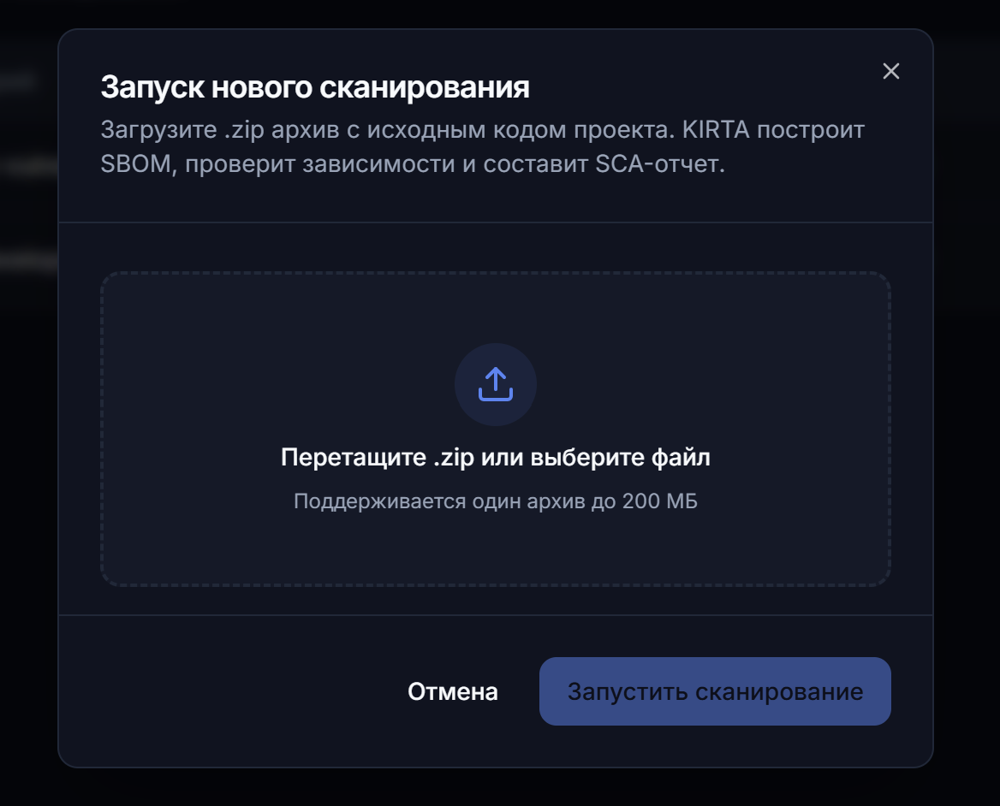
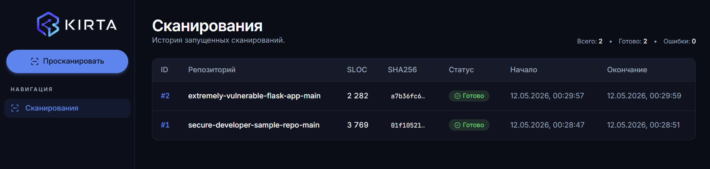
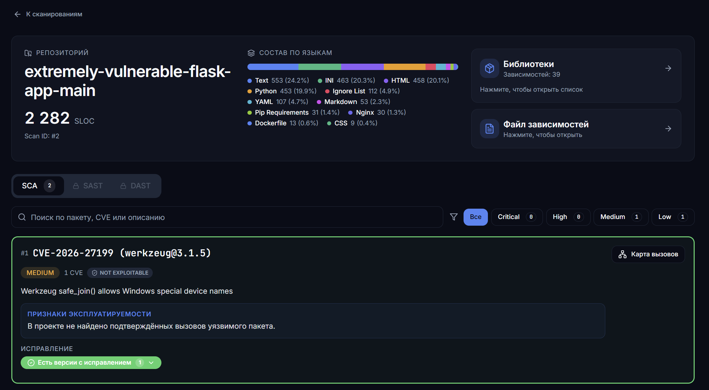
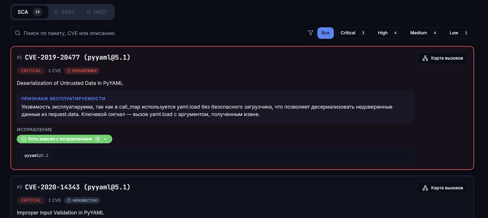
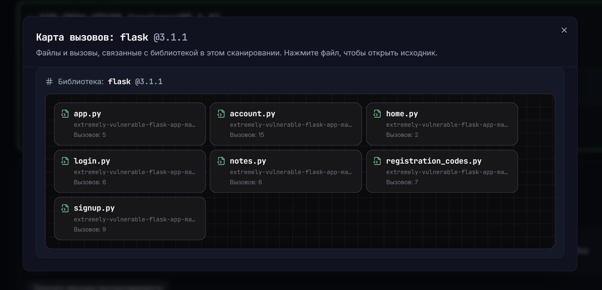
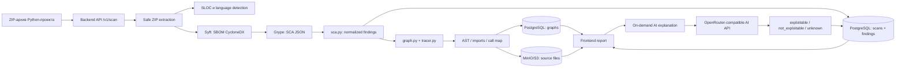

# KIRTA — AI Security Platform

<p align="left">
   <a href="https://kirta-security.ru/"></a> <a href="./LICENSE"></a>
</p>

<p align="left">
  
</p>

**Core stack:** Go, Gin, Python, React, TypeScript, PostgreSQL, MinIO/S3, Docker, Nginx  
**Security tooling:** Syft, Grype, SBOM, SCA, static code analysis, call map  
**AI layer:** OpenRouter-compatible AI explanations with strict JSON output

---

**KIRTA** — AI-платформа для объяснимого анализа уязвимостей в Python-проектах.

Проект объединяет **SBOM**, **SCA-сканирование**, **статический анализ исходного кода**, **call map** и **AI-объяснение**, чтобы помочь команде понять не только *какая CVE найдена*, но и *есть ли признаки её достижимости в конкретном коде*.

KIRTA работает как AI-слой поверх результатов **Syft**, **Grype** и анализа кода: снижает шум, помогает приоритизировать исправления и переводит технический security-отчёт в понятное объяснение для security, development и product-команд.

> Текущий репозиторий — MVP для Python-проектов и SCA-сценария. В нём реализован backend-пайплайн загрузки ZIP → SBOM → SCA → call map → отчёт, on-demand AI explanation для отдельного finding, frontend-интерфейс и CLI-инструменты для генерации security-артефактов.

---

## Live demo

Проект доступен по адресу: **https://kirta-security.ru/**

Демо-вход в приложение: **https://kirta-security.ru/login**

```text
Логин: parker
Пароль: parker
```

Демо-доступ позволяет посмотреть основной flow MVP:

- landing page;
- историю сканирований;
- загрузку ZIP-архива;
- SCA-отчёт;
- call map;
- просмотр evidence в исходном коде;
- AI explanation для отдельного finding.

---

## Быстрый доступ

| Раздел | Где находится |
|---|---|
| Live demo | `https://kirta-security.ru/` |
| Demo login | `https://kirta-security.ru/login` |
| Demo credentials | `parker / parker` |
| Список сканирований | `https://kirta-security.ru/scans` |
| Страница отчёта | `/:scanId`, например `https://kirta-security.ru/1` |
| Swagger UI | `/swagger/index.html` при запущенном backend |
| OpenAPI specification | `kirta-backend-api/openapi.yaml` |
| License | MIT License |

---

## Проблема

Классические security-сканеры хорошо находят известные уязвимости, но часто оставляют команду с несколькими нерешёнными вопросами:

1. Уязвимая библиотека действительно используется в проекте или просто присутствует в зависимостях?
2. Есть ли вызовы этой библиотеки в коде, связанные с потенциально опасным сценарием?
3. Что исправлять первым: CVE с высокой формальной severity или CVE, которая реально достижима в бизнес-логике?
4. Как объяснить риск разработчикам и продуктовой команде без ручного разбора большого JSON-отчёта?

В результате security backlog превращается в ручной triage: часть findings оказывается нерелевантной, часть требует долгого анализа, а действительно опасные дефекты могут теряться среди шума.

---

## Решение

KIRTA добавляет к классическому SCA-результату контекст исходного кода и AI-интерпретацию.

Платформа:

- принимает ZIP-архив Python-проекта;
- безопасно распаковывает архив;
- проверяет наличие Python-кода;
- считает SLOC и языковой состав проекта;
- строит SBOM через Syft;
- запускает SCA-анализ через Grype;
- преобразует большой SCA-отчёт в компактный формат findings;
- анализирует Python-код через AST/import/call tracing;
- строит call map по уязвимым библиотекам;
- сохраняет scan metadata, findings и graphs в PostgreSQL;
- сохраняет исходные файлы из call map в MinIO/S3-compatible storage;
- по запросу генерирует AI explanation для конкретного finding;
- показывает результат во frontend: список сканов, отчёт, findings, call map и исходный код с evidence.

Главная идея: **обычный SCA показывает список CVE, а KIRTA показывает признаки достижимости, evidence в коде и объяснение, почему finding важен или не подтверждён текущими статическими фактами**.

---

## KIRTA - AI Security Platform

KIRTA показывает путь от загрузки Python-проекта до объяснимого security-отчёта.

### Лендинг



### Авторизация



### Загрузка зип-архива



### История сканирований



### Отчет о сканировании



### AI обьяснение о найденном дефекте



### Карта вызовов



---

## Почему здесь нужен AI

Без AI KIRTA могла бы показать только технические факты:

- package;
- version;
- CVE;
- severity;
- fixed versions;
- imports;
- calls;
- call map.

Это полезно, но не отвечает на главный вопрос команды: **что означает этот набор фактов для реального риска продукта?**

AI в KIRTA используется не как “магическая оценка”, а как интерпретатор структурированного security-контекста:

- получает CVE, описание уязвимости, severity и ограниченный call map;
- анализирует, есть ли признаки практической достижимости;
- возвращает строго структурированный ответ;
- формирует короткое объяснение на русском языке;
- помогает перевести технические артефакты в решение: чинить сейчас, отложить или отправить на ручную проверку.

В backend реализован OpenRouter-compatible AI client с:

- `response_format: json_schema`;
- `strict: true`;
- `temperature: 0`;
- retry-логикой;
- валидацией ответа модели;
- ограничением размера call map, отправляемого в модель.

AI model response в текущем MVP компактный:

```json
{
  "exploitable": true,
  "explanation": "Есть достижимый вызов уязвимой библиотеки в коде проекта."
}
```

В API результат сохраняется в SCA finding как enum-статус:

```text
exploitable
not_exploitable
unknown
```

---

## Как работает KIRTA



---

## Техно-продуктовый вклад

KIRTA решает не только техническую, но и продуктовую проблему security-процессов.

| Критерий | Как KIRTA отвечает |
|---|---|
| Реальная польза бизнесу | Помогает быстрее понять, какие уязвимости создают реальный риск для продукта |
| AI как ключевая часть продукта | AI превращает SBOM/SCA/call-map факты в объяснимое решение для команды |
| Техническая реализация | Есть backend pipeline, storage, OpenAPI, SCA tooling, call-map analyzer, AI enrichment и frontend |
| Измеримый результат | Метрики считаются из scan artifacts: findings, severity, code usage, AI coverage, unknown rate |
| Нестандартность применения ИИ | AI применяется не для генерации текста “поверх всего”, а для интерпретации структурированного security-контекста |
| Качество подачи | Продукт показывает проблему, решение, технологию, ограничения, KPI и demo flow |

---

## Основной backend pipeline

| Шаг | Что происходит | Реализация |
|---|---|---|
| 1 | Пользователь загружает ZIP-архив Python-проекта | `POST /v1/scan` |
| 2 | Backend распаковывает архив и считает SHA-256 | `internal/service/scan_service.go` |
| 3 | Backend считает SLOC и языковой состав проекта | `go-enry` |
| 4 | Syft строит SBOM в CycloneDX JSON | `runSyftSBOM()` |
| 5 | Grype строит SCA-отчёт по SBOM | `internal/service/sca/` |
| 6 | Python-скрипт нормализует Grype JSON в findings | `kirta-backend-api/sca.py` |
| 7 | Python tracer строит call map по уязвимым библиотекам | `kirta-backend-api/graph.py`, `tracer.py` |
| 8 | Scan, findings и graphs сохраняются в PostgreSQL | `internal/persistance/db/` |
| 9 | Source files из call map сохраняются в MinIO/S3 | `internal/storage/` |
| 10 | Frontend показывает отчёт и evidence | `kirta-ui/src` |
| 11 | Пользователь запускает AI explanation для finding | `POST /v1/scans/{id}/findings/{finding_id}/explanation` |

---

## API overview

| Method | Endpoint | Назначение |
|---|---|---|
| `POST` | `/v1/scan` | Загрузить ZIP-архив и запустить анализ |
| `GET` | `/v1/scans` | Получить список сканирований |
| `GET` | `/v1/scans/{id}` | Получить полный отчёт по скану |
| `GET` | `/v1/scans/{id}/graphs?package=<name>` | Получить call map для библиотеки |
| `GET` | `/v1/scans/{id}/files/{filepath}` | Получить исходный файл из storage |
| `POST` | `/v1/scans/{id}/findings/{finding_id}/explanation` | Сгенерировать AI explanation для finding |

---

## Exploitability statuses

| Статус | Значение |
|---|---|
| `exploitable` | Есть признаки достижимости finding-а по текущим статическим фактам и AI explanation |
| `not_exploitable` | В текущих статических фактах нет подтверждённых вызовов уязвимого пакета или AI вернул отрицательную оценку |
| `unknown` | Недостаточно данных для уверенного вывода, требуется ручная проверка |

Важно: KIRTA не утверждает, что статический анализ гарантирует эксплуатацию или полную безопасность. Платформа помогает быстрее оценить признаки достижимости и приоритет исправления.

---

## Архитектура репозитория

```text
.
├── kirta-backend-api/                  # Backend API на Go/Gin
│   ├── cmd/main.go                     # Точка входа backend-сервиса
│   ├── internal/api/                   # HTTP handlers, routes, middleware
│   ├── internal/app/                   # Инициализация приложения
│   ├── internal/config/                # YAML-конфигурация
│   ├── internal/domain/                # Domain DTO: ScanInfo, ScaFinding, Graph
│   ├── internal/persistance/db/        # PostgreSQL repository
│   ├── internal/service/               # Scan pipeline, SCA, AI enrichment
│   ├── internal/storage/               # MinIO/S3-compatible storage
│   ├── migrations/                     # SQL migrations
│   ├── docs/                           # Swagger docs generated by swaggo
│   ├── openapi.yaml                    # OpenAPI specification
│   ├── sca.py                          # Преобразование Grype JSON в findings
│   ├── graph.py                        # Построение call map по библиотекам
│   └── tracer.py                       # AST/import/call tracing для Python
│
├── kirta-ui/                           # Frontend на React + TypeScript + Vite
│   ├── src/app/                        # Router, providers, app shell
│   ├── src/pages/                      # Landing, Login, Scans, ScanReport, NotFound
│   ├── src/features/                   # Auth, scans, SCA widgets, theme
│   ├── src/repositories/               # Repository/API layer
│   ├── src/components/                 # UI и layout-компоненты
│   └── deploy/nginx/                   # Nginx template и HTTPS setup script
│
├── docs/assets/                        # Скриншоты продукта для README
│   ├── landing.png
│   ├── login.png
│   ├── upload.png
│   ├── scans.png
│   ├── report.png
│   ├── finding-ai.png
│   └── call-map.png
│
├── tools/                              # CLI analysis helpers
├── kirta.py                            # CLI pipeline: Syft → Grype → Tiny-SCA → package trace
├── sca-tinifier.py                     # Сжатие Grype SCA JSON в compact Tiny-SCA
├── tiny-sca-schema.json                # JSON schema для Tiny-SCA формата
├── LICENSE                             # MIT License
└── README.md                           # Project overview
```

---

## Backend overview

Backend реализован на **Go + Gin** и отвечает за orchestration всего scan-пайплайна.

### Ключевые возможности backend

- загрузка ZIP-архива Python-проекта;
- безопасная распаковка ZIP с защитой от Zip Slip;
- проверка наличия Python-кода в архиве;
- подсчёт SLOC и языкового состава проекта;
- генерация SBOM через Syft;
- запуск Grype по SBOM;
- нормализация SCA-результата;
- построение call map по уязвимым библиотекам;
- сохранение scan metadata, findings и graphs в PostgreSQL;
- сохранение source files из call map в MinIO/S3-compatible storage;
- выдача исходного файла по API для просмотра во frontend;
- on-demand AI enrichment для отдельного finding;
- Swagger/OpenAPI документация.

### Backend stack

| Слой | Технологии |
|---|---|
| HTTP API | Go, Gin |
| Database | PostgreSQL, JSONB, pgx |
| Migrations | golang-migrate |
| Object storage | MinIO / S3-compatible storage |
| SCA tooling | Syft, Grype |
| Static analysis | Python `ast`, import resolution, call tracing |
| AI integration | OpenRouter-compatible Chat Completions API |
| API docs | OpenAPI, Swagger UI, swaggo |

---

## Frontend overview

Frontend реализован как SPA на **React + TypeScript + Vite**.

### Что есть во frontend

| Раздел | Возможность |
|---|---|
| Landing page | Продуктовое описание KIRTA, проблема, решение, demo flow |
| Login page | Demo/mock auth для MVP; на публичном стенде используется `parker / parker` |
| Scans page | История сканирований, статусы, SLOC, SHA-256, даты |
| Upload dialog | Drag-and-drop загрузка `.zip`, ограничение размера до 200 MB |
| Scan report page | Загрузка полного отчёта по `scanId` |
| SCA widgets | Severity badge, exploitability pill, fixed versions block |
| Search/filtering | Поиск по package/CVE/description и фильтрация по severity |
| Call map panel | Отображение файлов и вызовов уязвимой библиотеки |
| Source code modal | Получение исходного файла из backend и подсветка строк с evidence |
| Theme | Переключение темы через Zustand/localStorage |
| Routing | Проверка формата `/:scanId`, чтобы route не перехватывал `/scans`, `/login`, `/assets` и служебные пути |

Frontend ходит в backend через repository/API layer. По умолчанию API base URL — `/api`, а Vite dev server проксирует `/api` на backend.

### Frontend stack

| Слой | Технологии |
|---|---|
| Core | React 18, TypeScript, Vite |
| Routing | React Router v6 |
| Async data | TanStack Query |
| State | Zustand |
| UI | Tailwind CSS, shadcn-style primitives, Radix UI, lucide-react |
| Code viewer | react-syntax-highlighter |
| Quality | ESLint, Prettier |

---

## CLI tools

В корне репозитория есть отдельный CLI-пайплайн для генерации security-артефактов без запуска web-приложения.

### `kirta.py`

Запускает полный artifact generation pipeline:

1. Syft → `<repo>.cdx.json`
2. Grype → `<repo>-sca.json`
3. `sca-tinifier.py` → `<repo>-tiny-sca.json`
4. `tools/kirta_analyzer.py` → `<repo>-package-trace.json`

Пример:

```bash
python3 kirta.py ./path/to/python-project -o ./reports/python-project
```

Дополнительно можно передать пути к бинарникам:

```bash
python3 kirta.py ./path/to/python-project \
  -o ./reports/python-project \
  --syft-bin syft \
  --grype-bin grype
```

### `sca-tinifier.py`

Преобразует большой Grype JSON в компактный Tiny-SCA формат: CVE, package, version, severity, CWE, описание и locations.

```bash
python3 sca-tinifier.py \
  --source ./reports/project/project-sca.json \
  --output ./reports/project/project-tiny-sca.json
```

### `tools/kirta_analyzer.py`

Строит AST summary, import resolution и package trace/call map для Python-проекта.

```bash
python3 tools/kirta_analyzer.py \
  --project ./path/to/python-project \
  --source ./reports/project/project-tiny-sca.json \
  --output ./reports/project/project-package-trace.json
```

### `tools/kirta_agent_input_builder.py`

Объединяет Tiny-SCA и package trace в structured JSON для KIRTA Agent.

```bash
python3 tools/kirta_agent_input_builder.py \
  --repo-name project \
  --project ./path/to/python-project \
  --tiny-sca ./reports/project/project-tiny-sca.json \
  --package-trace ./reports/project/project-package-trace.json \
  --output ./reports/project/project-agent-input.json
```


## Быстрый старт: frontend

```bash
cd kirta-ui
npm install
npm run dev
```

Production build:

```bash
npm run build
npm run preview
```

Lint/format:

```bash
npm run lint
npm run format
```

---

## Быстрый старт: backend

Backend требует настроенные PostgreSQL, MinIO/S3-compatible storage, Syft и Grype.

### 1. Установить внешние инструменты

Нужны бинарники:

```text
syft
grype
```

Они должны быть доступны в `PATH` или указаны в конфигурации backend.

### 2. Подготовить конфигурацию

```bash
cd kirta-backend-api
cp config.example.yaml config.yaml
```

В `config.yaml` нужно заполнить:

- PostgreSQL connection;
- MinIO/S3 credentials;
- bucket name;
- paths to Syft/Grype;
- OpenRouter API key and model for AI explanation.

### 3. Запустить backend

```bash
go run ./cmd
```

По умолчанию backend стартует на:

```text
http://localhost:8080
```

Swagger UI:

```text
http://localhost:8080/swagger/index.html
```

---

## Конфигурация AI

Пример AI-related настроек в `config.yaml`:

```yaml
app:
  openrouter_api_key: "YOUR_OPENROUTER_API_KEY"
  openrouter_model: "openai/gpt-4.1-mini"
  openrouter_base_url: "https://openrouter.ai/api/v1"
  openrouter_timeout: 20s
  openrouter_callmap_max_files: 20
  openrouter_callmap_max_calls: 200
```

AI explanation рассчитывается on-demand для отдельного finding через API endpoint:

```http
POST /v1/scans/{id}/findings/{finding_id}/explanation
```

## Ограничения текущего MVP

KIRTA честно ограничивает область применения текущего MVP:

- основной сценарий сейчас — Python-проекты и SCA;
- demo auth не является production-ready авторизацией;
- качество AI explanation зависит от полноты CVE-описания, call map и доступного code context.

---

## Roadmap

### До ближайшего развития MVP

- поддержка большого количества других языков программирования, помимо Python;
- расширить схему AI-вердикта: confidence, priority, reason codes, recommendation;
- добавить массовую AI-приоритизацию findings;
- улучшить evidence chain в UI;
- добавить экспорт отчёта в PDF/JSON;
- добавить baseline-метрики по demo repositories.

### Дальше

- поддержка SAST findings;
- поддержка DAST findings;
- secrets/IaC/container security signals;
- интеграции с GitHub/GitLab;
- team workspace;
- role-based access;
- CI/CD mode для автоматического анализа pull requests.

---

## License

Проект распространяется под лицензией **MIT**: [`LICENSE`](./LICENSE).
